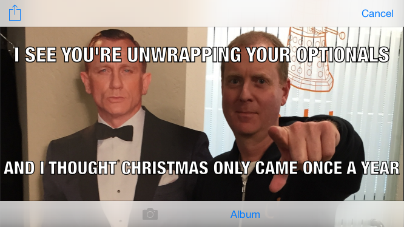

##App Specification: MemeMe 2.0, The Final Product
  iOS Developer Nanodegree
  
MemeMe is a meme-generating app that enables a user to attach a caption to a picture from their phone. After adding text to an image chosen from the Photo Album or Camera, the user can share it with friends. MemeMe also temporarily stores sent memes which users can browse in a table or a grid.

###The app has three pages of content:

1. Meme Editor View: Enables a user to add text to an image and share it.
2. Sent Memes View: Enables a user to browse sent memes in a table or a grid.
3. Meme Detail View: Displays an image of a sent meme

The three pages are described in detail below.
 
1. Meme Editor View:
  The Meme Editor View consists of an image view overlaid by two text fields, one near the top and one near the bottom of the image. This view has a bottom toolbar with two buttons: one for the camera and one for the photo album. The top navigation bar has a share button on the left displaying Apple’s stock share icon and a “Cancel” button on the right.
 
2. Sent Memes View:
  The sent memes view displays recently sent memes. It has a bottom toolbar with tabs that allow the user to toggle between viewing sent memes in a table and viewing them in a grid. The top navigation bar has a title that reads “Sent Memes” and an add button in the right corner displaying Apple’s stock “Add” icon. If the user taps the “table” tab on the left of the bottom toolbar, sent memes are displayed in a table. If the user taps on the “collection” tab on the right of the bottom toolbar, sent memes are displayed in a grid. Selecting a meme from the table or collection presents the Meme Detail View. Pressing the “add” button brings up the Meme Editor View.
       
2. Meme Detail View:
  The Meme Detail View displays the selected meme in an image view in the center of the page with the meme’s original aspect ratio. The detail view has a back arrow in the top left corner. To the right of the arrow reads the title of the previous view, “Sent Memes.”

##User Flow
  When the user presses the share button, Apple’s stock Activity View appears, displaying several options for sharing the meme. After an option is chosen, the Activity View is dismissed and the Sent Memes View appears. The Sent Memes View also appears upon pressing the “Cancel” button. Selecting a meme from the table or collection presents the Meme Detail View. Clicking on the back arrow of the Meme Detail View presents the previous Sent Memes View, either the table or collection.

